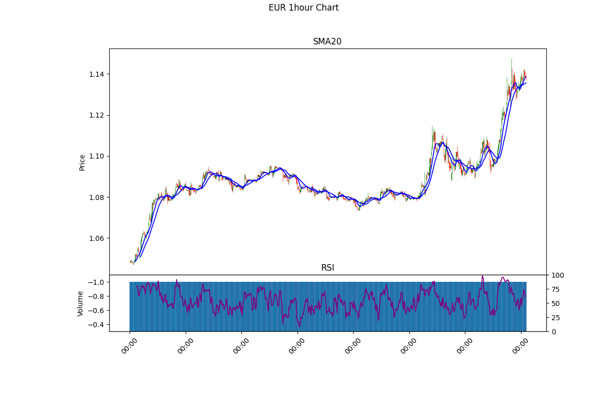
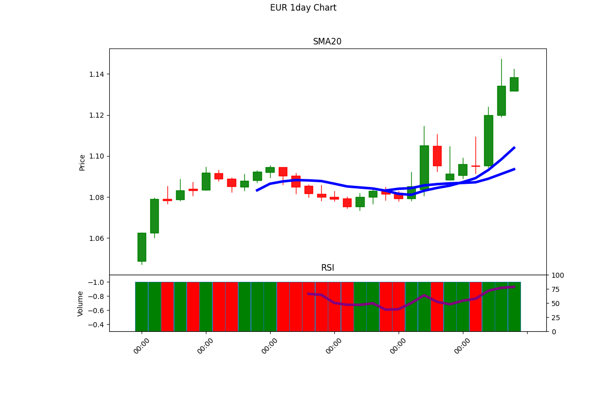

# Trader Workstation

## Overview

A trading workstation that interfaces with Interactive Brokers API for market data and trading operations.

## Implementation

- Uses ib_async library for asynchronous API integration
- Connects to IB TWS or IB Gateway on port 7497
- Supports multiple client connections

## API Features

- Market Data: Historical bars, tick data
- Contract Types: Stocks, Futures, Forex
- Data Types: TRADES, MIDPOINT
- Market Data Type: Delayed/Frozen (Type 4)

## Data Operations

- Historical data retrieval (bars and ticks)
- Data conversion to pandas DataFrame
- CSV export capability
- Real-time market data streaming

## Visualizations

